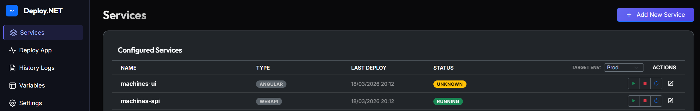
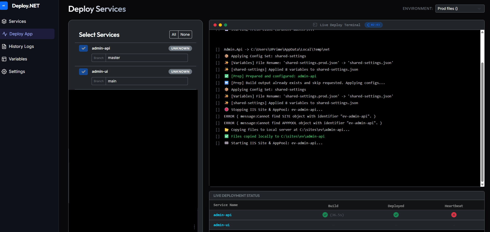

# NET Deploy CPO7

**Automated Deployment & Management System for .NET Applications**

NET Deploy is a powerful tool designed to automate the process of pulling, building, and deploying .NET services (WebAPI, MVC, Workers) and Node.js applications to remote VPS or local servers.

---

**© 2026 CPO7 - PROPRIETARY SOFTWARE. Free for learning, paid for commercial use.**

## Key Features
- **Git Integration**: Pull and build from any Git repository.
- **Multi-Service Deploy**: Deploy multiple services simultaneously.
- **IIS & Windows Services Support**: Automatic management of IIS sites and Windows Services.
- **Live Terminal Logs**: Real-time feedback during the deployment process.
- **Heartbeat Monitoring**: Automatic health checks after deployment.
- **Batch Operations**: Prepare all repositories before starting transfers.

## Getting Started

### 1. Server Configuration
- Ensure the API server (`net-deploy-api`) is running.
- Configure your Git settings and VPS environments in the settings panel.

### 2. UI Access
- Run the Angular UI on port `5432`.
- Configure your services with their Repo URL and target paths.

### 3. Deploy
- Select the services you want to deploy.
- Choose the target environment.
- Click **Deploy Selected** to start the automated process.

## System Requirements
- .NET 8.0+ SDK (for building).
- Node.js (for UI and Node.js builds).
- SSH/SFTP access to target VPS.

---

**© 2026 CPO7 - PROPRIETARY SOFTWARE. Free for learning, paid for commercial use.**
