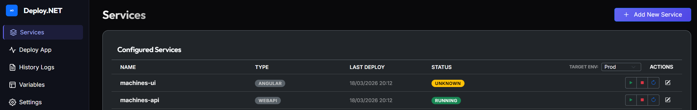
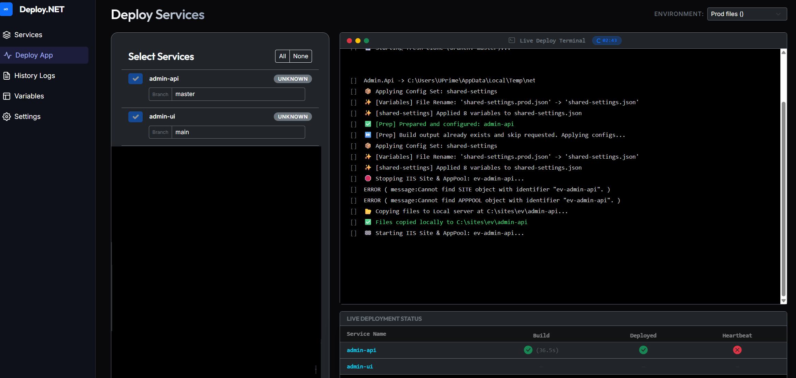

# NET Deploy CPO7

**Automated Deployment & Management System for .NET Applications**

NET Deploy is a powerful tool designed to automate the process of pulling, building, and deploying .NET services (WebAPI, MVC, Workers), Angular, and React applications to remote VPS or local servers.




---

**© 2026 CPO7 - PROPRIETARY SOFTWARE. Free for learning, paid for commercial use.**

## Key Features
- **Git Integration**: Pull and build from any Git repository.
- **Multi-Service Deploy**: Deploy multiple services simultaneously.
- **Framework Support**: Detailed support for .NET (WebAPI, Workers), Angular, React, and Node.js.
- **Windows & Linux Support**: Automatic management of Windows Services & IIS, plus native Linux support with **systemd** daemons & **Nginx** reverse proxy / static hosting.
- **Cross-Platform Runners**: One-click startup scripts for both Windows (
un-all.bat) and Linux (
un-all.sh).
- **Live Terminal Logs**: Real-time feedback during the deployment process.
- **Heartbeat Monitoring**: Automatic health checks after deployment.
- **Environment Variables Support**: Manage and update application settings during deployment.
- **Batch Operations**: Prepare all repositories before starting transfers.
- **Git Versioning & Rollback**: Browse commit history and rollback to previous versions of your services seamlessly.

## Getting Started

### 🐋 Fast Track: Running with Docker (Recommended)
The easiest way to get everything up and running is with **Docker Compose**. This will automatically start MongoDB, the API server, and the UI.

1.  Make sure you have [Docker Desktop](https://www.docker.com/products/docker-desktop) installed and running.
2.  Open a terminal in the project root.
3.  Run:
    ```bash
    docker compose up -d --build

    ```
4.  Open your browser at [http://localhost:5432](http://localhost:5432).

---

### Manual Setup

#### 1. Server Configuration
- Ensure the API server (`net-deploy-api`) is running.
- Configure your Git settings and VPS environments in the settings panel.

#### 2. UI Access
- Run the Angular UI on port `5432`.
- Configure your services with their Repo URL and target paths.

#### 3. Deploy
- Select the services you want to deploy.
- Choose the target environment.
- Click **Deploy Selected** to start the automated process.

### Automatic IIS setup

For WebAPI and MVC deployments, the destination folder is named after `IisSiteName`.
For example, `D:\Sites\old-folder` becomes `D:\Sites\api.example.com` when the IIS site name is `api.example.com`.
When the service target path is empty, an existing site's IIS physical path is used.
For a missing site, the **Default folder for new IIS sites** setting under **VPS Environments** supplies the base folder: `D:\Sites` creates `D:\Sites\<IisSiteName>`.
If both settings are empty and the site is missing, the path defaults to `C:\inetpub\wwwroot\<IisSiteName>`.
The site's root physical path and the file transfer destination both use this resolved path.

Missing sites and application pools are created automatically. A new site uses the optional **IIS port** from the service's environment configuration (1–65535, default 80), with the site name as its HTTP host header, so automatic creation requires a valid host name. Configure DNS and any HTTPS certificate/binding separately. Existing bindings are preserved; an existing site's physical path is updated to the resolved destination.

IIS setup and start/stop commands run on the selected Windows server (over SSH for a remote environment). Windows PowerShell and IIS management components must be available there, and the deployment account needs permission to manage IIS and write to the destination. A failed IIS setup or start fails the deployment instead of reporting success.

## System Requirements

> ⚠️ All of the following must be installed on the **server machine** that runs the API.

- **[Git](https://git-scm.com/download/win)** *(Required)* — Used to clone and pull repositories. Must be installed on the server.
- **.NET 10.0+ Runtime** — Required to run the API server. [Download](https://dotnet.microsoft.com/download)
- **[MongoDB](https://www.mongodb.com/try/download/community)** *(Required)* — Used to store system configurations and deployment logs.
- **Node.js + npm** *(Optional)* — Required only if deploying Angular/React projects. [Download](https://nodejs.org)
- **SSH/SFTP access** *(Optional)* — Required only when deploying to a remote VPS.

---

## Disclaimer & Warranty

**THE SOFTWARE IS PROVIDED "AS IS", WITHOUT WARRANTY OF ANY KIND**, EXPRESS OR IMPLIED. IN NO EVENT SHALL CPO7 BE LIABLE FOR ANY CLAIM, DAMAGES, OR OTHER LIABILITY, WHETHER IN AN ACTION OF CONTRACT, TORT OR OTHERWISE, ARISING FROM, OUT OF OR IN CONNECTION WITH THE SOFTWARE OR THE USE OR OTHER DEALINGS IN THE SOFTWARE.

**Use of this software is at your own risk.** CPO7 is not responsible for any damage, data loss, or system failure caused by the software.

---

**© 2026 CPO7 - PROPRIETARY SOFTWARE. Free for learning, paid for commercial use.**
